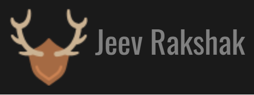
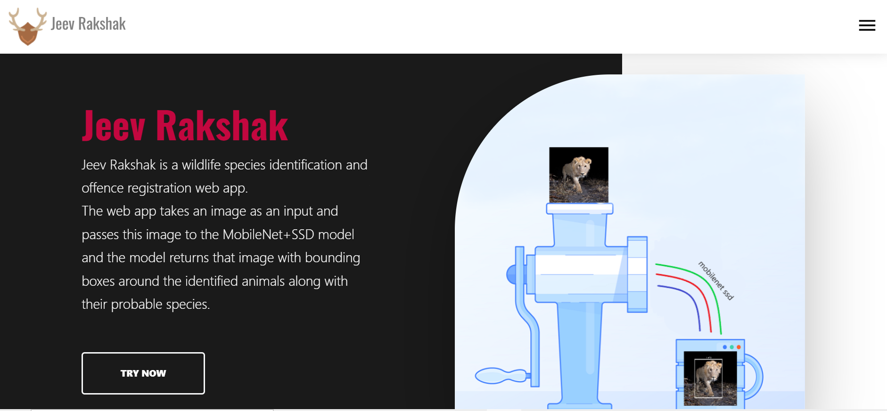
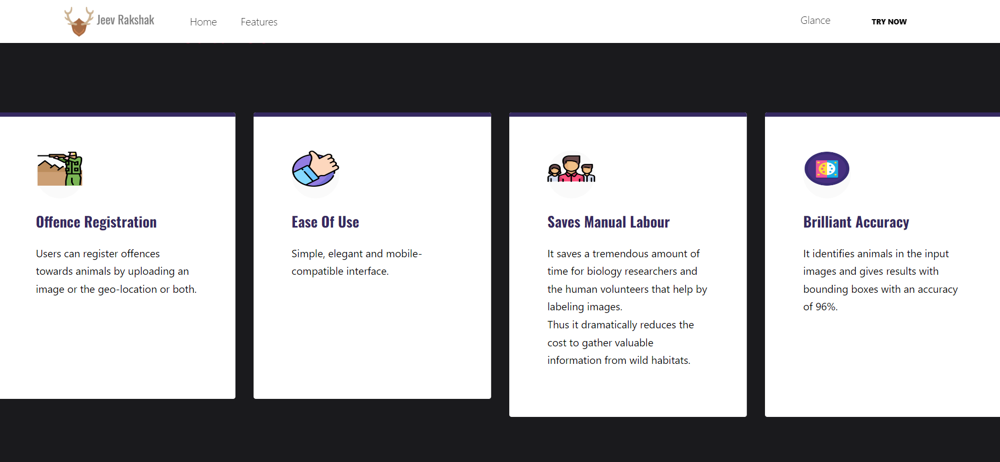
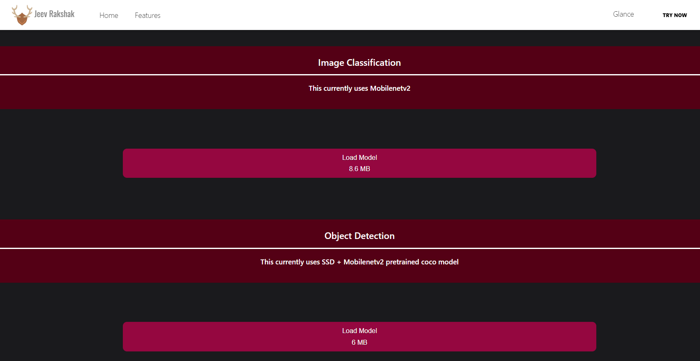
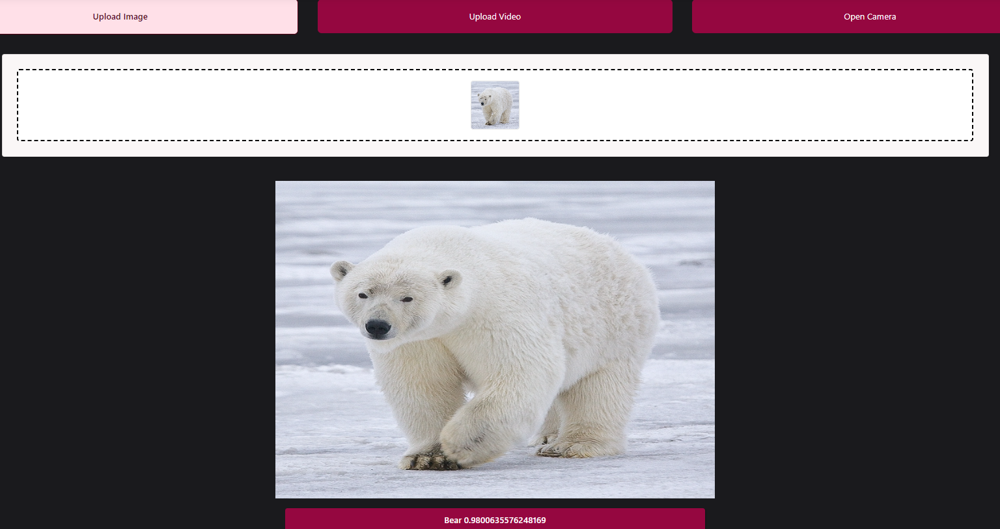
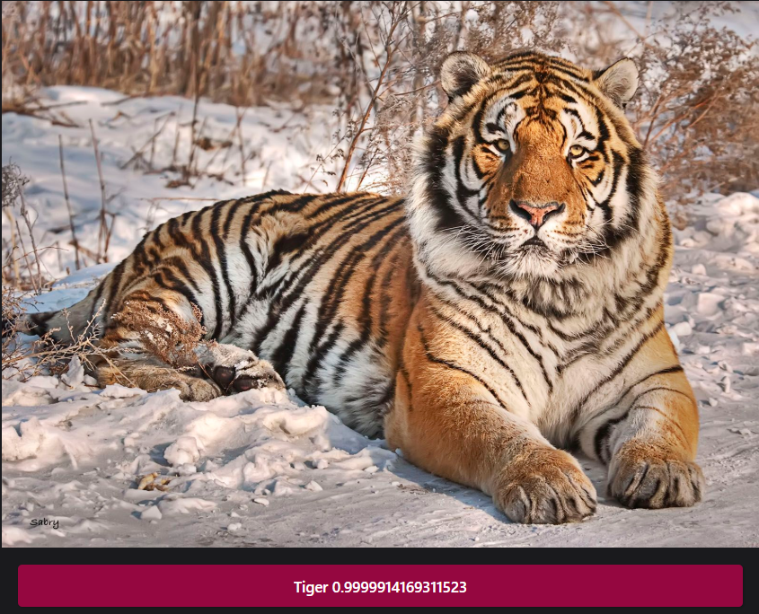

<!--  -->

# Prani Rakshak
Wildlife Species Identification using client-side Neural Networks

You can view the demo [here](https://omkar-anabathula-prani-rakhshak.netlify.app/).

<!--  -->

# Table of Contents

* [Description](https://github.com/amurto/jeev-rakshak#description)
* [Dependencies](https://github.com/amurto/jeev-rakshak#dependencies)
* [Installation](https://github.com/amurto/jeev-rakshak#installation)
  * [Prerequisites](https://github.com/amurto/jeev-rakshak#prerequisites)
  * [Instructions](https://github.com/amurto/jeev-rakshak#instructions)
* [Usage](https://github.com/amurto/jeev-rakshak#usage)
* [Contributors](https://github.com/amurto/jeev-rakshak#contributors)
* [License](https://github.com/amurto/jeev-rakshak#license)

# Description

Prani Rakshak is a Wildlife species identification and Alarm signalling web app.
Whenever wild animals intrude human areas, the animals are beaten,killed or hunted for self-defense or poaching. Else the animals attack people because of their basic nature. The only solution to this is to identify any intruding animal or human in the prohibited areas and inform the forest authorities from which they can take a appropriate action

Various modern technologies have been developed for wild animal monitoring, including radio tracking, wireless sensor network tracking, satellite and global positioning system (GPS) tracking, and monitoring by motion sensitive camera traps. Motion-triggered remote cameras or "camera traps" are an increasingly popular tool for wildlife monitoring, due to their novel features equipped, wider commercial availability, and the ease of deployment and operation.

The project aims to identify wild animals and inform respective authorities for their timely rescue. 

We have implemented the following features as a part of this system:
* MobileNetv2 is a streamlined architecture that uses depthwise separable convolutions to construct lightweight deep convolutional neural networks and provides an efficient model for mobile and embedded vision applications. We have trained an image classification model by applying transfer learning on the coco MobileNetv2 pretrained model. It can classify the following species efficiently and accurately.
    * Elephant 
    * Tiger 
    * Lion 
    * Panda
    * Bear 
    * Deer
    * Person

* This model was converted into JavaScript supported GraphModels using the [Tensorflowjs Convertor](https://github.com/tensorflow/tfjs/tree/master/tfjs-converter).
* A React web app which can process input images and videos as well as a Realtime feature which uses the device camera to process frames and display the result on a canvas.
* The model for classification and detection have a size of 8.6 MB respectively, which it makes it easy and faster to load. The models are saved in the Indexed DB after loading them for the first time.
# Website
<!--  -->
<!--  -->
<!--  -->
<!--  -->
<!--  -->



### Image Classification



# Dependencies

* [TensorFlow.js](https://www.tensorflow.org/js)
* [Keras](https://keras.io/)
* [npm](https://www.npmjs.com/)
* [React.js](https://reactjs.org/)

# Installation

### Prerequisites

Install Node.js and npm using the link above. Follow instructions on their respective websites. Npm is included with Node.js

### Instructions

Clone the repository
```bash
git clone https://github.com/Omkar-here/Prani-Rakshak.git
```

Install all the dependencies
```bash
cd web_app 
npm install
```

# Usage

Run the project
```bash
cd web_app
npm start
```

Open a web browser and go to
```bash
http://localhost:3000
```


